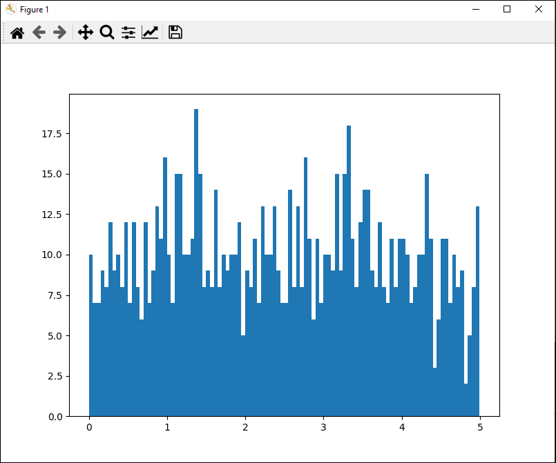

# <span style="color:red;">Machine Learning 1.0:</span> <span style="color:blue;">Osservare e Distribuire Uniformemente i dati</span>
___
## Traccia del problema
Sino ad ora abbiamo lavorato con una quantità di dati esigua, tuttavia, gli scenari reali prevedono l'impiego di dataset massicci e per questo motivo vi è una forte difficoltà nell'ottenere un cosi alto quantitativo di dati nella vita reale *(quest'area del ML prende il nome di ***big data***)*, data questa difficoltà nell'ottenere fin da subito grosse quantità di dati ci limiteremo a generare un set di dati relativamente grande utilizzando le funzioni messeci a disposizione dal modulo *numpy*

```python
import numpy as np
dataset = np.random.uniform(0.0, 5.0, 1000)
```

In questo caso abbiamo generato un vettore contenente $1000$ elementi, ognuno di questi elementi ha un valore casuale compreso nell'intervallo $(0.0, 0.5)$.

## Osservare i dati
Lavorare con grosse quantità di dati è un problema non da poco per noi esseri umani, pertanto, ci rifugiamo nell'utilizzo di un grafico *(plot)*, questo grafico può essere di qualsiasi tipo e sarà fondamentale per eseguira una prima analisi dei dati, infatti, osservare i dati su di un grafico ci aiuta anche a capire l'andamento o il carattere di un set di numeri.
Possiamo mandare in plot il nostro set di dati in python utilizzando il modulo:

```python
import matplotlib.pyplot as plt
```

dopodiché possiamo utilizzare i metodi di *pyplot* per mandare a schermo un istogramma con tutti i dati ottenuti:

```python
import matplotlib.pyplot as plt
plt.hist(dataset, 100)
plt.show()
```

Nel codice di cui sopra abbiamo creato un istogramma con 100 barre, dopodiché, abbiamo mandato in output il grafico, il risultato finale dovrebbe essere un grafico del tipo:



⚠: *Ovviamente, essendo casuale la generazione di numeri il grafico nell'immagine varierà ad ogni run del programma.*
