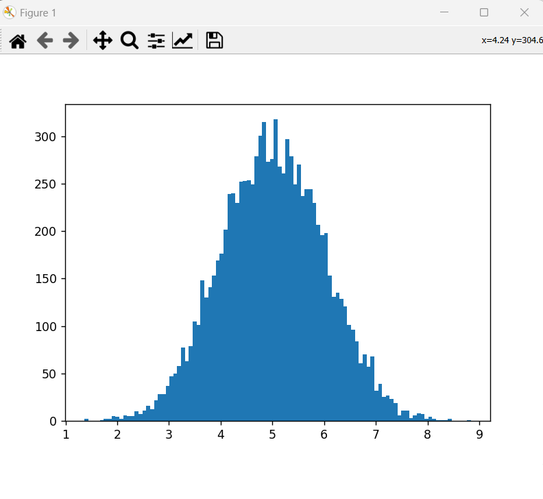

# <span style="color:red;">Machine Learning 1.1:</span> <span style="color:blue;">Distribuzione Normale dei dati (Gaussiana)</span>
___
## Traccia del problema
L'esercizio mostra come *normalizzare* i dati distribuendoli secondo una ***gaussiana***, nel nostro esercizio abbiamo utilizzato il modulo *random* di *numpy* per generare un elevato numero di valori casuali, nello specifico, abbiamo utilizzato il metodo *"normal()"* di *random*.

```python
import numpy as np
dataset = np.random.normal(5.0, 1.0, 10000)
```

In questo caso abbiamo generato $10000$ valori casuali che hanno una media di $5.0$ con una deviazione standard di $1.0$.

Una volta ottenuto il dataset possiamo provvedere a mandare a schermo il grafico dei dati generati *normalmente* utilizzando *pyplot* di *matplotlib*.

```python
import matplotlib.pyplot as plt
plt.hist(dataset, 100)
plt.show()
```

L'output che otterremo sarà un istogramma come quello di cui sotto:


## Differenza tra Distribuzione Uniforme e Distribuzione Normale (Gaussiana)
La distribuzione dei dati è fondamentale, in quanto, determina quale algoritmo e quale approccio seguire per l'addestramento, tra le varie tipologie di distribuzione, quelle più importanti sono **uniforme** e **normale**.

* **Distribuzione Uniforme &rarr;** Questa tipologia di distribuzione si verifica quando ogni valore di un intervallo ha la stessa probabilità di essere scelto, per esempio, in un intervallo di valori compreso da $1$ a $10$, allora, ognuno di questi valori ha il $10 \%$ di essere scelto.
Nel caso della distribuzione uniforme si può proseguire verso un approccio che preveda l'utilizzo di una griglia. oppure, utilizzare un albero di decisione.

* **Distribuzione Normale (Distribuzione Gaussiana) &rarr;** Questa distribuzione dei dati avviene quando la maggior parte dei dati del dataset è concentrata intorno alla media, nel nostro caso la media era di $5.0$, quando i dati sono distribuiti normalmente è consigliabile utilizzare una rete neurale o una regressione lineare.
