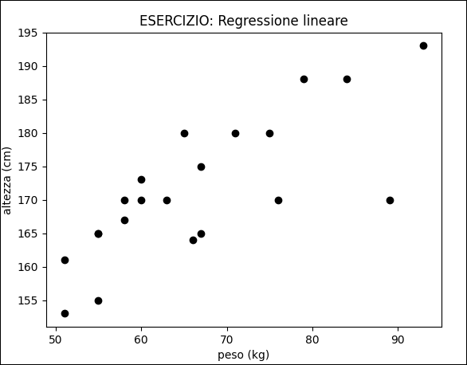
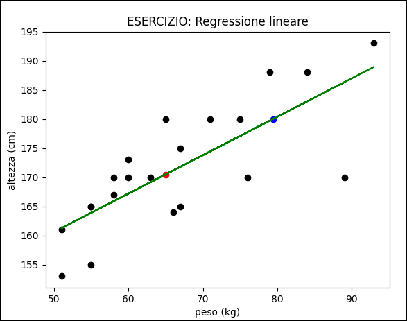

# <span style="color:red;">Machine Learning 2.1:</span> <span style="color:blue;">Regressione Lineare per la previsione dei dati</span>
___
## Traccia del problema
In questo esercizio vogliamo utilizzare la ***regressione lineare*** per predire un valore, nello specifichiamo vogliamo allenare un sistema affinchè riesca a predire il peso o l'altezza di un individuo in baso all'input passato, che sia peso nel caso in cui volessimo predire l'altezza o l'altezza nel caso in cui volessimo predire il peso.

⚠: *Come già accennato nell'esercizio precedente gli algoritmi di regressione lineare sono basati sulla funzione lineare, pertanto, raccomandiamo di recuperare la lezione precedente per comprendere appieno quanto vedremo d'ora in avanti.*

## Dataset
Prima di poter prevedere eventuali informazioni il nostro modello deve essere addestrato con dei dati già noti, nello specifico andremo ad applicare quello che si definisce ***apprendimento supervisionato***, ovvero, forniremo al nostro modello un dataset nella quale è contenuta sia l'informazione di input che quella di output, successivamente il modello sarà in grado di predire nuove informazioni basandosi sugli input e gli output che gli sono stati dati durante la fase di apprendimento.
Dunque, provvediamo subito ad implementare subito un semplice dataset che contenga pochi dati dove ognuna delle singole informazioni del set si compone di due sole features, ovvero, il peso e l'altezza di un individuo umano.

|PESO (kg)|ALTEZZA (cm)|
|---------|------------|
|65|180|
|75|180|
|60|173|
|93|193|
|66|164|
|84|188|
|67|175|
|89|170|
|71|180|
|63|170|
|51|161|
|58|167|
|67|165|
|51|153|
|60|170|
|55|165|
|55|155|
|58|170|
|76|170|
|55|165|
|79|188|

In questo dataset abbiamo raccolto il peso di individui a caso, inoltre, dei vari individui abbiamo anche registrato la loro altezza, dando in pasto queste informazioni al nostro modello saremo poi in grado di stabilire in maniera del tutto *probabilistica* il peso o l'altezza di un individuo estraneo al dataset, ovviamente, il modello sarà in grado solamente se gli viene somministrata quanto meno una informazione di partenza, in questo caso il peso o l'altezza dell'individuo in analisi.

## Applichiamo la regressione lineare
In questa sezione vogliamo percorrere step by step tutte le operazioni che ci porteranno poi a comprendere al massimo il concetto di regressione lineare.

### Osservare i dati su un grafico a dispersione *(scatter)*

La prima cosa che faremo è osservare i dati del dataset su di un grafico a dispersione in modo da avere già ad occhio un idea della natura e del comportamento dei nostri dati di partenza, più che altro c'interessa sapere la relazione che vi è tra i valori $x$ e $y$, in questo caso la relazione che vi è tra $peso$ e $altezza$, dunque, provvediamo a mandare in output il grafico utilizzando le librerie *numpy* e *matplotlib*:

```python
import matplotlib.pyplot as plt
import numpy as np

peso = np.array([65, 75, 60, 93, 66, 84, 67, 89, 71, 63, 51, 58, 67, 51, 60, 55, 55, 58, 76, 55, 79])
altezza = np.array([180, 180, 173, 193, 164, 188, 175, 170, 180, 170, 161, 167, 165, 153, 170, 165, 155, 170, 170, 165, 188])

plt.scatter(peso, altezza, c="black")
plt.title("ESERCIZIO: Regressione lineare")
plt.xlabel("peso (kg)")
plt.ylabel("altezza (cm)")
plt.show()
```

L'output che otterremo eseguendo il codice di cui sopra sarà:



Ora non ci resta che trovare la regressione lineare ideale al nostro problema, affinchè il nostro modello sia poi in grado di prevedere valori futuri.

### Individuare la retta ideale

A questo punto non ci resta che trovare la retta ideale che mostri al meglio la relazione tra le due variabili del dataset, la retta ideale è quella che minimizza la distanza tra i punti del nostro grafico e la retta stessa, fortunatamente il modulo *scipy* di python ci viene in aiuto e ci mette a disposizione un metodo che ci ritorna tutti i parametri ideali per la regressione lineare del nostro specifico problema.

Nello specifico andremo ad utilizzare il metodo *linregress()*, tale metodo ci ritornerà più valori:

1. ***slope*** &rarr; *La pendenza della nostra retta.*
1. ***intercept*** &rarr; *Il punto di start della nostra retta.*
1. ***r*** &rarr; *La relazione che vi è tra le variabili passate in input alla funzione, questa variabile assume un valore compreso nell'intervallo* $[-1; 1]$ *dove il valore* $0.0$ *indica che non vi è alcuna relazione tra le variabili, mentre, un valore che sia* $1$ *oppure* $-1$ *indica che tra le due variabili vi è una forte relazione e che dunque vale la pena orientarsi verso la regressione lineare per la predizione di informazioni*.
1. ***p*** &rarr; *In questa variabile è contenuto il* $p_{value}$ *per il momento ci basti sapere che è semplicemente un valore che misura quanto sia probabile ottenere una relazione lineare tra i dati del dataset.*
1. ***std_err*** &rarr; *In questa variabile è contenuto il valore di* ***deviazione standard*** *ovvero quel valore che indica quanto sono distribuiti i dati, nello specifico, diremo che quanto più è basso questo valore maggiore sarà la vicinanza dei dati al valore medio, diversamente, una deviazione standard elevata indica che i dati sono lontani dal valore medio.*

```python
import matplotlib.pyplot as plt
import numpy as np
from scipy import stats

peso = np.array([65, 75, 60, 93, 66, 84, 67, 89, 71, 63, 51, 58, 67, 51, 60, 55, 55, 58, 76, 55, 79])
altezza = np.array([180, 180, 173, 193, 164, 188, 175, 170, 180, 170, 161, 167, 165, 153, 170, 165, 155, 170, 170, 165, 188])

#calcolo i parametri ideali della mia retta lineare
slope, intercept, r, p, std_err = stats.linregress(peso, altezza)

plt.scatter(peso, altezza, c="black") 
plt.plot(peso, slope*peso+intercept, c="green") #mandiamo a schermo la retta di regressione lineare
plt.title("ESERCIZIO: Regressione lineare")
plt.xlabel("peso (kg)")
plt.ylabel("altezza (cm)")
plt.show()
```

Il codice di cui sopra mostrerà un grafico nella quale è contenuto uno scatter dei dati del dataset ed una retta di colore verde che rappresente la nostra regressione lineare, si noti come questa sia la retta con la minor distanza tra i vari punti dello scatter.


⚠: *In questo caso applicare la regressione lineare ha senso, in quanto, il valore di relazione è:* $\color{#DC006C}r=0.77$ *, tale valore dimostra che vi è una forte relazione tra le due varibili poi, in quanto,* $0.77$ *è un numero molto vicino a* $1$*.*

### Predire valori con la regressione lineare

A questo punto abbiamo praticamente vinto e possiamo utilizzare la retta individuata per predire il valore di nuove altezze e di nuovi pesi, nello specifico possiamo predire:

* L' ***altezza*** di un individuo dato il suo peso con l'equazione: $\color{#DC006C}altezza=(slope*peso)+intercept$

* Il ***peso*** di un individuo data la sua altezza con la formula inversa dell'equazione precedente: $\color{#DC006C}peso=(altezza-intercpet)/slope$

Provvediamo subito a mettere in pratica quanto detto e proviamo a predire il peso di un individuo e l'altezza di un altro individuo utilizzando la regressione lineare in base ai dati del nostro dataset.

```python
import matplotlib.pyplot as plt
import numpy as np
from scipy import stats

peso = np.array([65, 75, 60, 93, 66, 84, 67, 89, 71, 63, 51, 58, 67, 51, 60, 55, 55, 58, 76, 55, 79])
altezza = np.array([180, 180, 173, 193, 164, 188, 175, 170, 180, 170, 161, 167, 165, 153, 170, 165, 155, 170, 170, 165, 188])

#calcolo i parametri ideali della mia retta lineare
slope, intercept, r, p, std_err = stats.linregress(peso, altezza)

#predizione altezza
nuovo_peso1 = 65
nuova_altezza1 = slope*nuovo_peso1+intercept

#predizione peso (formula inversa)
nuova_altezza2 = 180
nuovo_peso2 = (nuova_altezza2 - intercept)/slope

plt.scatter(peso, altezza, c="black")               #scatter del dataset
plt.plot(peso, slope*peso+intercept, c="green")     #plot della retta di regressione lineare
plt.scatter(nuovo_peso1, nuova_altezza1, c="red")   #predizione della nuova altezza
plt.scatter(nuovo_peso2, nuova_altezza2, c="blue")  #predizione del nuovo peso
plt.title("ESERCIZIO: Regressione lineare")
plt.xlabel("peso (kg)")
plt.ylabel("altezza (cm)")
plt.show()
```

L'output del codice di cui sopra produce un grafico in cui individuiamo in:

* ***nero*** &rarr; *I punti dei dati del dataset di partenza*.
* ***verde*** &rarr; *La retta della regressione lineare*.
* ***rosso*** &rarr; *La previsione circa l'altezza del nuovo individuo il cui peso è* $65kg$*.*
* ***blu*** &rarr; *La previsione circa il peso del nuovo individuo la cui altezza è* $180cm$*.*

