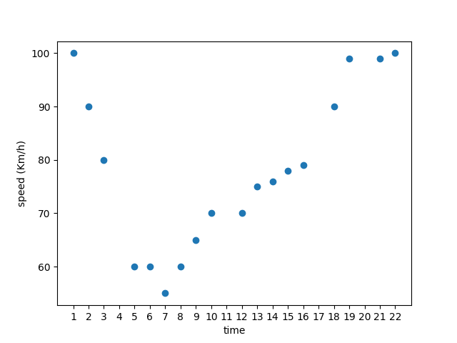
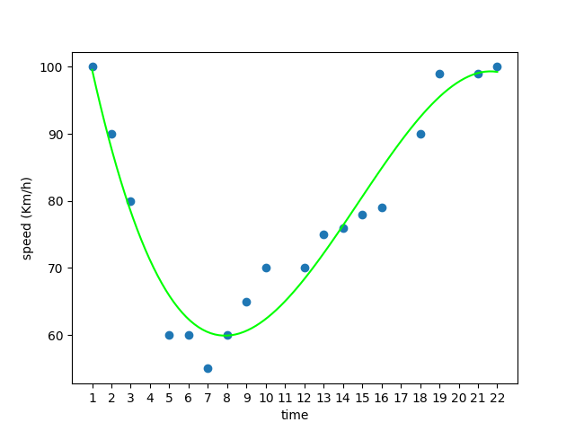
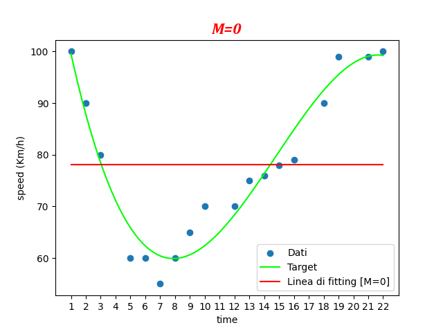
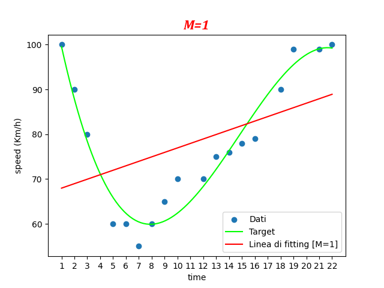
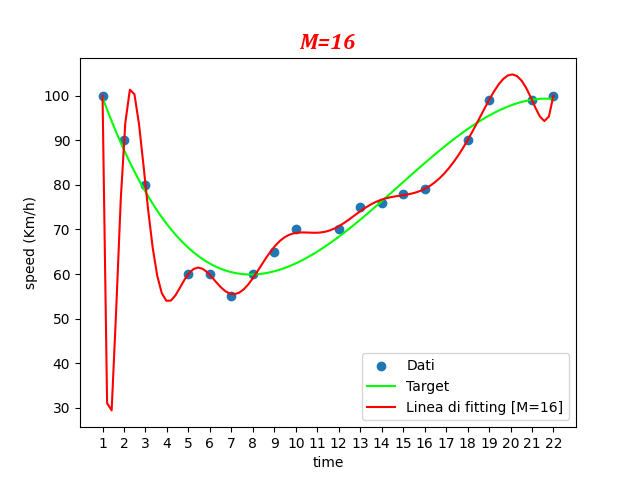
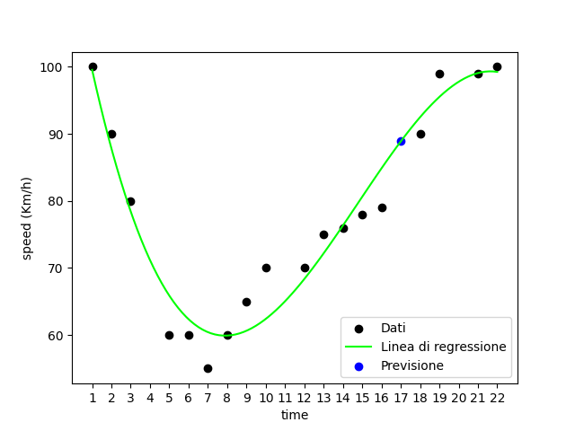

# <span style="color:red;">Machine Learning 2.2:</span> <span style="color:blue;">Regressione Polinomiale</span>
___

## Traccia del problema

In questo esercizio vogliamo analizzare la velocità delle auto mentre passano al casello in un determinato orario della giornata, nello specifico, il nostro dataset si compone di $18$ veicoli di cui per ognuno di essi si è registrata la velocità e l'orario di attraversamento al casello.

| | | | | | | | | | | | | | | | | | | |
|-|-|-|-|-|-|-|-|-|-|-|-|-|-|-|-|-|-|-|
|$\color{#dc0066}Time$|1:00|2:00|3:00|5:00|6:00|7:00|8:00|9:00|10:00|12:00|13:00|14:00|15:00|16:00|18:00|19:00|21:00|22:00|
|$\color{#dc0066}Velocità$|100|90|80|60|60|55|60|65|70|70|75|76|78|79|90|99|99|100|

Proviamo a mandare in output lo *scatter* di questi dati per osservarne la distribuzione.

```python
import numpy as np
import matplotlib.pyplot as plt

time = np.array([1,2,3,5,6,7,8,9,10,12,13,14,15,16,18,19,21,22])
speed = np.array([100,90,80,60,60,55,60,65,70,70,75,76,78,79,90,99,99,100])

plt.scatter(time, speed)
plt.xlabel("time")
plt.ylabel("speed (Km/h)")
plt.xticks(np.arange(1,23))
plt.show()
```
Ci verrà ritornato il grafico seguente:



A prima vista salta subito all'occhio la non linearità dei dati, dunque, non possiamo optare per la regressione lineare.

## Regressione polinomiale

Proprio come la regressione lineare la polinomiale si basa sulla relazione tra le variabili del dataset, nel nostro caso le variabili sono il *veicolo* e la sua rispettiva *velocità*, dunque, tutto ciò che dobbiamo fare è tracciare una linea tra questi dati in modo che la distanza della linea stessa dai dati sia minima.

In questo caso utilizziamo alcuni metodi del modulo ***numpy*** per tracciare la linea ideale che attraversi tutti i dati polinomialmente distribuiti.

```python
import numpy as np
import matplotlib.pyplot as plt

#definizione del dataset
time = np.array([1,2,3,5,6,7,8,9,10,12,13,14,15,16,18,19,21,22])
speed = np.array([100,90,80,60,60,55,60,65,70,70,75,76,78,79,90,99,99,100])

#definizione della regressione polinomiale
mymodel = np.poly1d(np.polyfit(time, speed, 3))
myline = np.linspace(1, 22, 100)

#settaggi del grafico
plt.scatter(time, speed)
plt.plot(myline, mymodel(myline))
plt.xlabel("time")
plt.ylabel("speed (Km/h)")
plt.xticks(time)
plt.show()
```

Il codice di cui sopra mostra la linea ideale per la regressione polinomiale:



### Analizziamo le fasi salienti del codice

Il codice implementato non è difficilissimo da comprendere, sostanzialmente la struttura è sempre la stessa, infatti, il focus ricade principalmente sui metodi del modulo ***numpy*** che abbiamo utilizzato.

Con il metodo `poly1d()` andiamo ad istanziare un oggetto `poly1d` che rappresenta semplicemente un polinomio in input passeremo il vettore contenente tutti i coefficienti.

Come coefficienti al polinomio passiamo proprio la regressione polinomiale dei nostri dati utilizzando un altro metodo di *numpy* chiamato `polyfit()`, in questo metodo passiamo le variabili del caso e cosa molto importante dobbiamo passare come argomento il grado del polinomio che vogliamo andare a generare, nel nostro caso il grado del polinomio è `3`, tratteremo più avanti l'importanza di tale valore.

```python
import numpy as np
mymodel = np.poly1d(np.polyfit(time, speed, 3))
```

Una volta definita la regressione lineare e salvata nella variabile `mymodel`, prima di poter mandare la regressione lineare in plot abbiamo però bisogno di definire un vettore di punti per l'asse `x`, infatti, la variabile `mymodel` contiene solamente i punti `y`, pertanto provvediamo subito alla creazione di questo vettore di valori utilizzando il metodo `linspace()`.

```python
import numpy as np
myline = np.linspace(1, 22, 100)
```

Nella variabile `myline` sarà contenuto un vettore contenente `100` elementi equidistanti tutti compresi nell'intervallo $[1,22]$

A questo punto possiamo mandare in plot la linea di regressione polinomiale.

```python
import matplotlib.pyplot as plt
plt.plot(myline, mymodel(myline))
```

## Il problema Overfitting

Quando si applica la regressione polinomiale è fondamentale fare attenzione al grado del polinomio che si sceglie, in quanto, è il fattore principale nel modello che andiamo ad implementare.

Matematicamente parlando possiamo vedere questa funzione come:

$$
\color{#DC0066}y(x,w)=w_0+w_1x^1+w_2x^2+...+w_Mx^M=\sum_{j=0}^M{w_jx^j}
$$

La funzione in questione è più banale di quello che potrebbe sembrare e possiamo sostituire quei valori con i dati del nostro dataset dell'esercizio precedente, nello specifico avremo che la variabile `w` è il nostro vettore dei coefficienti e quindi i valori di `speed`.

Dalla formula matematica non è ancora chiaro quanto incida il grado del polinomio nella determinazione della linea che al meglio esegua il ***fitting*** dei dati, pertanto, provvediamo a vedere graficamente quanto incida il grado del polinomio.

⚠: *Nei grafici a seguire vedremo in ***verde*** la linea di regressione ideale che sappiamo già essere quella di grado `3`, mentre, in ***rosso*** vedremo la linea di regressione con un grado polinomiale diverso da `3`.*






Come ci dimostrano le immagini il grado del polinomio gioca un ruolo fondamentale nella determinazione del ***fitting*** dei dati, questo fantomatico *fitting* è essenziale, in quanto, influenzerà massicciamente il modello, in altre parole, maggiore sarà il grado del polinomio maggiore sarà il *fitting*, dunque, si potrebbe pensare di utilizzare un grado elevato fin da subito, ma questa sarebbe una pessima scelta, infatti, nel grafico con `M=16` abbiamo che la linea polinomiale tocca perfettamente tutti i punti del dataset, ma, questo non gioca a nostro favore, poiché, cosi facendo il modello diventa troppo rigoroso e poco elastico questo significa che sarà in grado di predire solamente valori sulla base di dati già visti e questo rende inutile il modello, il fenomeno appena descritto prende il nome di ***overfitting*** e a noi non sta bene poichè il nostro obbiettivo è ottenere un modello ben *generalizzato* che sia in grado di predire valori sulla base di dati che non ha mai visto prima.

Ricapitolando, bisogna sempre fare molta attenzione al grado del polinomio che si va a scegliere e non bisogna ne sceglierne uno troppo basso ne uno troppo alto, altrimenti il modello potrebbe non essere efficace nella predizione dei dati.

#### Codice per la simulazione di differenti valori di `M`

Di seguito, il codice python per mandare in plot un grafico simile a quelli visti prima, si può utilizzare tale codice per simulare diversi valori da dare a `M` così da poter comprendere al meglio il meccanismo di regressione polinomiale.

```python
import numpy as np
import matplotlib.pyplot as plt

#dataset
time = np.array([1,2,3,5,6,7,8,9,10,12,13,14,15,16,18,19,21,22])
speed = np.array([100,90,80,60,60,55,60,65,70,70,75,76,78,79,90,99,99,100])

#regressione polinomiale ideale
mymodel = np.poly1d(np.polyfit(time, speed, 3))
myline = np.linspace(1, 22, 100)

#regressione polinomiale con overfitting
wrongmodel = np.poly1d(np.polyfit(time, speed, 16))

#settaggi del grafico
myFont = {"family":"Cambria", "size": 16, "color":"red", "weight":"bold", "style":"italic"}
labels = ["Dati", "Target", "Linea di fitting [M=16]"]
plt.scatter(time, speed)
plt.plot(myline, mymodel(myline), c="lime")
plt.plot(myline, wrongmodel(myline), c="red")
plt.xlabel("times")
plt.ylabel("speed (Km/h)")
plt.xticks(time)
plt.title("M=16", fontdict=myFont)
plt.legend(labels)
plt.show()
```

## Coefficiente di Determinazione ($R^2$) del nostro modello

Nella lezione relativa alla *Regressione Lineare* abbiamo visto come sia utile misurare la bontà di un modello utilizzando il coefficiente di determinazione meglio noto come valore $R^2$, proviamo anche in questo caso a testare la bontà del nostro modello, per farlo utilizzeremo il metodo `r2_score()` del modulo `sklearn.metrics`.

Il prototipo del metodo in questione è:

```python
from sklearn.metrics import r2_score
r2 = r2_score(y, mymodel(x))
```

Se applichiamo tale metodo al nostro esercizio con la seguente istruzione

```python
R2 = r2_score(speed, mymodel(time))
```

Otterremo come output i seguenti risultati

`R2 = 0.922 con M=3`

`R2 = 0.998 con M=16`

Si noti come con `M=3` il valore sia molto vicino a `1` e quindi il modello risulta essere molto accurato, d'altro canto con `M=16` il modello risulta essere troppo accurato in quanto `R2` risulta essere estremamente vicino a `1` e quindi vi sono altissime probabilità di avere un modello che soffra di *overfitting*.

## Predire informazioni con la regressione polinomiale

Vediamo ora come utilizzare il modello implementato per predire nuovi dati estranei al dataset di partenza.

Vogliamo prevedere la velocità di un veicolo che attraversa il casello alle ore `17:00`, per farlo implementiamo la riga di codice

```python
predictionOfSpeed = mymodel(17)
```

se andiamo a stampare il valore di `predictionOfSpeed` ci verrà mostrato il valore di `88.8 Km/h`, possiamo anche osservare l'informazione predetta nel nostro grafico


