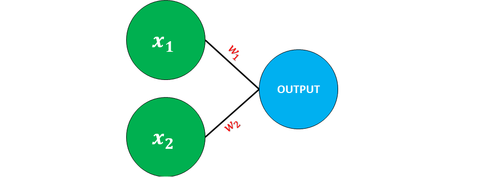

# Machine Learning 3.0: Percettrone
___

## Traccia del problema
Creare un percettrone che sia in grado di stabilire se valga la pena o meno andare al concerto, al percettrone verranno passati 5 input, ogni input sarà una variabile chiave sull'andare o meno al concerto ed ognuna di queste variabili avrà un peso, ovvero, quanto per noi quella variabile inficia sulla decisione di andare o meno al concerto:

|Criterio|Valore|Peso|
|--------|--------|--------|
|Il cantante è bravo| $$x_1=0\ o\ 1$$ | $$w_1=0,7$$|
|Il tempo è buono| $$x_2=0\ o\ 1$$ | $$w_2=0,6$$|
|Il mio amico verrà con me| $$x_3=0\ o\ 1$$ | $$w_3=0,5$$|
|Il cibo sarà servito| $$x_4=0\ o\ 1$$ | $$w_4=0,3$$|
|L'alcol sarà servito| $$x_5=0\ o\ 1$$ | $$w_5=0,4$$|

**⚠:** *Ovviamente i pesi variano da individuo a individuo, in questo caso per me il fattore più importante è la bravira del cantante, tuttavia, per qualcun'altro potrebbe essere fondamentale la presenza di un amico, pertanto, tutti i pesi inseriti sono da considerarsi soggettivi.*

**⚠:** *In questo esercizio, per semplicità, abbiamo impostato dei pesi manualmente il che annulla il concetto di IA e ML in sé, in quanto, lo scopo ultimo del ML è quello di addestrare una IA che sia in grado di stabilire essa stessa dei pesi alle features del problema in modo del tutto autonomo.*

## Descrizione
Un percettrone rappresenta il primo passo per la creazione di una rete neurale, nello specifico, diremo che un percettrone rappresenta un ***neurone artificiale***, il percettrone in sè rappresenta la forma più basilare di rete neurale e consiste nel prendere degli input, questi input hanno un ***valore*** e un ***peso*** **(weight)**, in base al valore e al peso in input il percettrone ci ritorna un valore di *
***output***.
>Rappresentazione grafica di **Percettrone**

**
LEGENDA
**

$x_1 = INPUT_1$

$x_2 = INPUT_2$

$w_1 = PesoInput_1$

$w_2 = PesoInput_2$

## Funzionamento algoritmo di un percettrone

Un percettrone prende in input un insieme di valori binari (0,1), ognuno di questi valori ha il proprio corrispettivo peso, l'output che il percettrone ci fornirà sarà anche'esso un valore binario e si basa su di un banale algoritmo che prevede:
1. Impostare un valore di soglia, ovvero, un valore detto ***bias*** che determinerà la scelta finale del percettrone.
1. Calcolare il prodotto di ogni valore per il proprio peso:

$$x_1*w_1$$

$$x_2*w_2$$

$$...$$

$$x_n*w_n$$

1. Sommare tutti i valori ottenuti dai prodotti dello *step 2*.
1. Stabilire il valore binario di output, in base alla ***somma ponderata*** ottenuta il percettrone ritorna 0 o 1 se:

$$output = 1\ se\ somma\ ponderata > soglia$$

$$output = 0\ se\ somma\ ponderata < soglia$$

