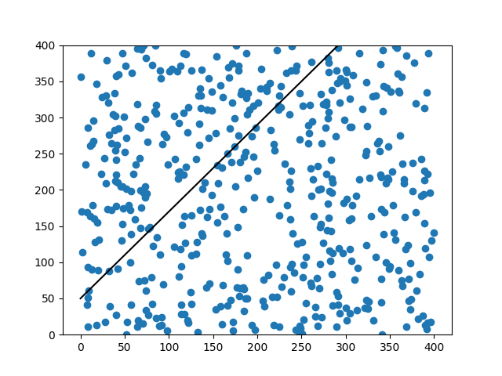
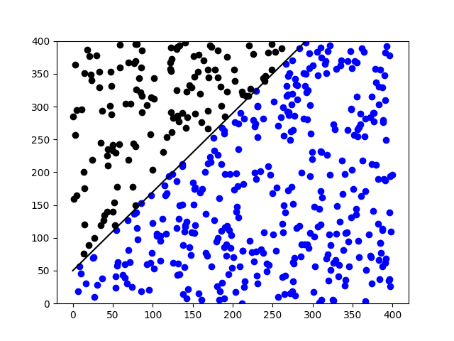

# <span style="color:red;">Machine Learning 4.0:</span> <span style="color:blue;">Pattern Recognition</span>
___

## Traccia del problema
Il pattern recognition è un concetto che permette alle reti neurali di riuscire a classificare un dato e per farlo possono essere impiegati i *percettroni*, questi percettroni fungeranno poi da classificatori binari, quindi, ogni percettrone classificherà con uno `0` o con un `1` il dato che gli sarà somministrato.

## Grafico a dispersione e retta lineare

Immaginiamo di avere un grafico a dispersione ove all'interno vi sono tutte le informazioni del nostro dataset e che questi dati siano attraversati da una linea retta che possiamo ipotizzare rappresenti la retta di regressione lineare, il risultato che otterremo sarà più o meno un grafico come quello qui sotto.



Di seguito, il codice in grado di produrre il grafico mostrato:

```python
import matplotlib.pyplot as plt
import random

# Creo 500 valori casuali per i punti XYnumPoints = 500
xPoints = [random.uniform(0, 400) for i in range(numPoints)]
yPoints = [random.uniform(0, 400) for i in range(numPoints)]

# Definisco la funzione lineare
def f(x): return x * 1.2 + 50

# Aggiungo al grafico la retta lineare e i valori casuali
fig, ax = plt.subplots()
ax.set_ylim(0, 400)
ax.plot([0, 400], [f(0), f(400)], color='black')
ax.scatter(xPoints, yPoints)
plt.show()
```

Nel nostro caso abbiamo utilizzato valori fissi per la la slope `a` e per intercetta `b` della nostra funzione lineare $\color{#dc0066}y=ax+b$, tuttavia, in uno scenario reale utilizzaremmo la regressione lineare e dunque una retta lineare con intercetta e slope adeguari alla classificazione che ci interessa eseguire.

## Scindiamo i punti al di sopra e al di sotto della retta lineare

A questo punto possiamo creare un vettore di `500` elementi chiamato `desired` dove al suo interno è possibile trovare due soli valori, ovvero, `0` e `1`, rispettivamente per indicare i valori al di sotto della retta e quelli al di sopra.

Per stabilire se un punto si trova al di sotto o al di sopra ci basta una semplice equazione:

$$
\color{#dc0066}yPoints_i > xPoints_i = 0
$$

$$
\color{#dc0066}yPoints_i \leq xPoints_i = 1
$$

Una volta ottenuto questo vettore possiamo provvedere a colorare i singoli punti in maniera differente, dunque, coloreremo di nero i punti al di sopra e di blu quelli al di sotto, cosi facendo avremo un grafico in grado di mostrare visivamente a quale classe appartiene un determinato dato.



## Codice

Di seguito, il codice per la creazione in python di un grafico come quello di cui sopra:

```python
import matplotlib.pyplot as plt
import random

# Creo 500 valori casuali per i punti XY
numPoints = 500
xPoints = [random.uniform(0, 400) for i in range(numPoints)]
yPoints = [random.uniform(0, 400) for i in range(numPoints)]

# Definisco la funzione lineare
def f(x): return x * 1.2 + 50

# Stabiliso per ogni punto la classe di appartenenza
desired = [1 if yPoints[i] > f(xPoints[i]) else 0 for i in range(numPoints)]

# Aggiungo al grafico la retta lineare e i valori casuali
fig, ax = plt.subplots()
ax.set_ylim(0, 400)
ax.plot([0, 400], [f(0), f(400)], color='black')

# Coloro di nero i punti al di sopra della retta e di blu quelli al di sotto
for i in range(numPoints):
    color = 'blue' if desired[i] == 0 else 'black'
    ax.scatter(xPoints[i], yPoints[i], c=color)

plt.show()
```